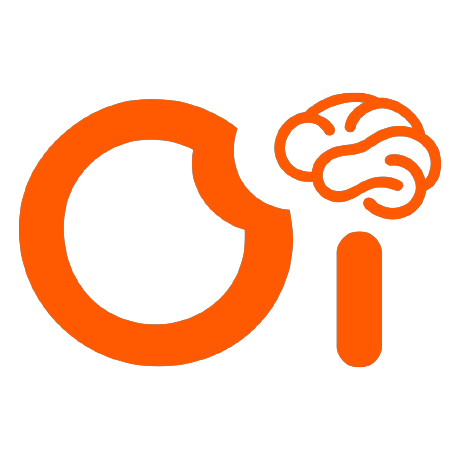

<p align="center"></p>

# 视频EEG实验：17组旧版与45组情绪融合版

本仓库提供Windows实验室电脑使用的PsychoPy视频EEG程序。**只保留一个实验启动入口：`run_experiment.bat`**，在窗口中选择版本和Demo/正式。

这次是文件组织、入口和新数据路径整理，**不改变17组或45组的固定视频成员、播放/答题流程、量尺、题库或已有进度**。旧电脑上的数据、视频、Python环境和已发离线包不删除。下列说明以当前GitHub源码为准；历史小包仍按包内说明使用。

## 目录导航

- [首次安装与开始运行](#首次安装与开始运行)
- [版本选择：我应该选哪一个](#版本选择我应该选哪一个)
- [每个目录和根目录文件有什么用](#每个目录和根目录文件有什么用)
- [视频下载、复制和路径配置](#视频下载复制和路径配置)
- [统一数据路径及旧被试续跑](#统一数据路径及旧被试续跑)
- [实验流程与全部按键](#实验流程与全部按键)
- [设备配置及完整YAML](#设备配置及完整yaml)
- [实验室硬盘更新](#实验室硬盘更新)
- [结束核对、故障和排查](#结束核对故障和排查)
- [维护脚本和验证方法](#维护脚本和验证方法)

## 首次安装与开始运行

### 1. 下载的是源码，视频另行准备

1. 打开[仓库首页](https://github.com/18yiba/visual-video-task)，选择Code → Download ZIP；完整解压到可写本地目录，例如`D:/Experiments/visual-video-task`。
2. 不要在ZIP预览窗口内双击BAT。确认所选文件夹直接包含`run_experiment.bat`、`video_eeg`、`scripts`和`README.md`。
3. 用Windows 10/11 64位；文件所在磁盘需要给视频和EEG数据留出空间。路径可与开发电脑不同，不要求D盘、E盘或EDY用户名。
4. 源码不含`.venv`、Python运行时、正式视频或被试数据。仅下载代码可以安装并运行两个Demo；正式实验还必须准备对应材料和真实设备。

### 2. 只安装一次环境

双击根目录`install_lab_env_uv.bat`。这是转发入口，实际调用`scripts/install_lab_env_uv.bat`和同目录PS1。

安装器使用uv准备Python3.12和项目`.venv`，安装PsychoPy、BrainCo/LSL等依赖并检查环境；不要求Node.js，也不需要在系统PATH里手动配置Python。首次安装需要联网访问下载源。现有健康环境可以复用，不要每次采集都重新安装。

- 成功后应存在`.venv/Scripts/python.exe`。
- 安装日志在`logs/install_*.log`；失败时保留日志，不要删除旧环境和旧数据后盲目重试。
- 安装结束会生成普通Demo的合成练习材料；融合Demo也会自动准备自身练习材料。
- 运行环境检查：在项目根目录打开PowerShell，执行：

```powershell
.\.venv\Scripts\python.exe scripts/check_video_eeg_env.py
```

命令示例均从项目根目录执行，下同。无需激活环境，显式调用`.venv`中的Python可避免用错解释器。

### 3. 先通过Demo

1. 双击`run_experiment.bat`。
2. 选择“旧版视频EEG：17组”或“最新融合版：45组，七级评分”。
3. 选择“Demo（模拟EEG）”，点击“进入实验”。
4. 在下一页填写测试编号（如`DEMO_TEST`）和Session，选择全屏或窗口；不要用正式被试做练习。
5. 普通Demo应完成10段合成视频、3道练习内容题；融合Demo应出现普通视频喜好、1道内容题、紧接的疲劳页及情绪视频的七级效价/唤醒页。
6. 核对声音、视频画面、F/J和数字按键、Esc退出与续跑、CSV/事件/模拟EEG文件写出。Demo通过不代表真实设备已连接。

### 4. 正式实验

1. 按后面的材料部分放置视频。17组需要普通母库；融合版同时需要普通母库和最终情绪库。
2. 检查材料清单、真实时长和校验值；不能用文件总数代替完整核验。
3. 连接设备，确认放大器开机、电量、阻抗、连接方式和采样率。先由主试做一次无被试真实采集短测，确认EEG样本增长及事件写出。
4. 再双击同一个`run_experiment.bat`，选正确版本和“正式（真实EEG）”。程序读取所选版本YAML中的设备设置，默认BrainCo SDK、1000Hz；正式入口不会主动启用模拟采集。
5. 填写被试编号和Session。已有被试必须使用原协议、原编号、原Session。不要把17组的Session 8当作45组的Session 8继续。
6. 终端会显示本次数据保存根目录，结束后显示本次采集位置。每天第一次开采前由主试核对一次。

## 版本选择：我应该选哪一个

| 窗口选项 | 用途 | 固定Session数 | 普通内容抽查 | 情绪与其他主观评分 |
|---|---|---:|---|---|
| 旧版视频EEG：17组 | 原17组实验继续采集；仍可部署到新电脑 | 17 | 每组18道，原完整版题库 | 无情绪、喜好和疲劳页 |
| 最新融合版：45组，七级评分 | 当前融合协议 | 45 | 每组9道，约10分钟净视频一道 | 普通视频喜好；抽查后疲劳；情绪效价/唤醒1–7 |
| 兼容：34组视频EEG | 勾选“显示其他历史版本”后可选，供已有34组续跑 | 34 | 每组18道 | 无情绪评分 |
| 兼容：45组九级评分 | 已有V1被试继续原量尺 | 45 | 保持V1原设置 | 情绪效价/唤醒1–9 |
| 兼容：旧2779题库 | 极早期题库记录续跑 | 按旧配置17组 | 使用原2779题快照 | 保持原配置 |

17组净视频平均约177.5分钟，34组约88.76分钟，融合45组约90.13–90.23分钟；都是净视频时间，答题、休息和重播另计，没有到90分钟自动截断。固定成员不能为了整理文件而重新生成。

各版完整说明： [17组](docs/versions/legacy17.md) · [34组](docs/versions/legacy34.md) · [九级V1](docs/versions/emotion-v1.md) · [七级V2](docs/versions/emotion-v2.md)。

## 每个目录和根目录文件有什么用

```text
visual-video-task/
  run_experiment.bat                 唯一实验启动入口：选版本、Demo或正式
  install_lab_env_uv.bat              首次环境安装入口，不是实验入口
  download_materials.bat              下载普通视频母库，不下载情绪库
  README.md                          本完整操作指南
  assets/brand/company_logo.png      公司橙色标志，保留透明背景；README和启动信息页共用
  AGENTS.md                          维护人员/自动化修改代码时的规则
  pyproject.toml / setup.py           Python项目及本地模块安装信息
  lab_uv_env.toml / uv.toml           实验室环境依赖与uv设置
  requirements-psychopy.txt           安装脚本使用的依赖声明
  THIRD_PARTY_NOTICES.md              第三方组件说明
  .gitignore / .gitattributes         Git排除数据、环境及文件字节处理规则
  video_eeg/                         范式源码，不能只复制其中一个runner
    config/                          各版本YAML、固定清单、题库及材料索引
    devices/                         BrainCo、Neuracle、模拟等采集接口
    experiment/                      显示、视频播放、回答、休息和采集管理
    storage/                         连续EEG与事件文件写入
    utils/                           状态/视频库/marker/数据路径等公共逻辑
  scripts/
    launch_experiment.py             统一启动选择窗口与版本调度
    install_lab_env_uv.bat/.ps1       安装器内部实现
    check_video_eeg_env.py            检查当前Python依赖和运行能力
    prepare_demo_materials.py        创建普通Demo合成视频和练习题
    patch_pyglet_win32.py            Windows环境兼容处理，由安装器使用
    download_materials.py            普通母库续传、下载与校验
    audit_emotion_materials.py        融合正式材料的存在/时长/哈希检查
    offline_* / deploy_* / apply_*   已发硬盘包的配置继承、部署与安全补丁
    repository_layout.json          发布时排除旧入口/旧文档的明确清单
    maintenance/                    构建发行包、固定清单、题库导出及材料诊断
    validation/                     自动窗口/Demo/退出/断流验证，仅供维护
  docs/
    versions/                       同一版本的流程、依据和该版改进合并说明
    operations/                     跨版本材料、离线部署、数据/EEG排查
    maintenance/                    总维护记录与逐文件清理去向
    evidence/                       普通材料Release机器可读核验回执
    reports/                        两份历史汇报Word：34组与九级V1
  stimuli/videos/                   普通正式视频可放此处，源码仅空占位
  data/sourcedata/                  统一新数据入口，源码仅空占位
  tests/                           自动化测试，不是实验记录
  vendor/                          必需的本地第三方模块及许可证
```

运行后还会生成`.venv`（环境）、`.uv_lab_env`（安装工作文件）、`.psychopy_appdata`（PsychoPy设置）、`.tmp`（临时文件）、`logs`（安装/核查日志）、`stimuli/demo`及融合练习材料、`runtime_patch_backups`（安全补丁备份）。这些不随源码上传。不要把本机已有的`runtime/python312`、data或视频库当作GitHub未包含的“无用目录”删除。

### config目录为何还保留多个相似文件

| 文件/目录 | 作用 | 能否改名或删掉 |
|---|---|---|
| video_legacy_17_config.yaml | 17组正式参数与原保存位置兼容信息 | 保留 |
| video_emotion_config.yaml | 最新45组V2正式参数 | 保留 |
| video_emotion_demo_config.yaml | V2合成Demo参数 | 保留 |
| video_config.yaml / video_demo_config.yaml | 34组正式与普通Demo；旧脚本也依赖 | 保留，不能因名字通用就改写成V2 |
| video_emotion_v1_config.yaml / video_emotion_demo_v1_config.yaml | 九级V1兼容配置 | 保留已有V1状态所需量尺 |
| video_legacy_2779_config.yaml / video_ready*.yaml | 早期题库/程序兼容 | 保留，统一入口不把它们冒充最新版 |
| session_manifest.csv | 原17组固定成员 | 禁止重新生成以覆盖在采分组 |
| session_manifest_34.csv | 34组固定成员 | 同上 |
| session_manifest_emotion_v1.csv | V1与V2共享的45组固定成员 | 名字含v1但V2仍使用，不是废文件 |
| complete_questions_20260908/ | 完整版普通视频题库、哈希/标注信息 | 不随意替换被试正在使用的题库 |
| 其他题库目录 | 旧2779题与历史兼容 | 不删旧状态依赖的快照 |
| emotion_source_index_v1.csv | 最终情绪视频ID、路径、标签、时长、SHA256等 | 不是最初随机抽样计划，必须保留 |
| materials_manifest*.json / 标签CSV / 排除清单 | 下载校验、正式纳入/排除、来源追踪 | 文件名相似不表示内容重复 |

## 视频下载、复制和路径配置

### 普通视频：17组和融合版共同使用

双击`download_materials.bat`，从[普通材料Release](https://github.com/18yiba/visual-video-task/releases/tag/materials-v1-20260910)下载并校验。母库84个视频ZIP分包，7996段、约44.2GB；固定正式清单使用其中7949段。不要只下载其中一个ZIP就开始正式实验。

下载器默认把视频放在本项目`stimuli/videos`。也可复用项目旁`video_materials/formal_v1/videos`；保留原视频文件名，不改编号、不剪辑、不转码。

如果已从硬盘获得普通母库，无需再下载；把文件放到上述位置之一或在所选YAML的`protocol.video_library_dir`填写实际路径。完整手动分包与续传细节见[材料说明](docs/operations/MATERIALS.md)。

### 情绪视频：仅融合版正式实验需要

最终集合为3138段、约9.87GB，正/中/负各1046段；Positive内Excitation/Relaxation=523/523，Negative内Fear/Sad/Tension=349/349/348。只使用经过最终校验的集合，不重新抽样，不随意换成同标签其他视频。

这批文件**不在普通视频Release或源码ZIP内**。现有实验室硬盘副本为`E:/video/video_materials/formal_v1/emotion_video/selected`。复制整个selected，保持子目录和文件名；不复制148GB原始数据、不复制parquet缓存、不复制其他被试data。没有副本时需取得主试保存的同一最终视频集合，或依据最终来源索引从[官方Conna/eMotions](https://huggingface.co/datasets/Conna/eMotions)恢复并逐一校验；本仓库不是全量eMotions下载器。

推荐布局：

```text
D:/Experiments/
  visual-video-task/
    run_experiment.bat
    stimuli/videos/*.mp4               普通库方案一
  video_materials/formal_v1/
    videos/*.mp4                       普通库方案二，二选一
    emotion_video/
      selected/
        positive/excitation/*.mp4
        positive/relaxation/*.mp4
        neutral/neutral/*.mp4
        negative/fear/*.mp4
        negative/sad/*.mp4
        negative/tension/*.mp4
      metadata/selected_videos.csv      材料维护方保留的最终追踪表
```

情绪材料放其他磁盘时，在项目根目录建立`emotion_library.local.json`：

```json
{"emotion_root":"F:/Materials/emotion_video"}
```

这里指向包含selected的目录，不能指向selected自身。本机覆盖顺序为`VIDEO_EEG_EMOTION_ROOT`环境变量 → 这个JSON → YAML的`protocol.emotion_library_dir`。Windows路径在JSON中建议使用正斜杠，避免反斜杠转义错误。本机路径文件不上传GitHub。

正式融合材料核查：

```powershell
.\.venv\Scripts\python.exe scripts/audit_emotion_materials.py
```

应验证全部11087段固定材料可访问，ffprobe可读，情绪文件SHA256匹配。审核结果在`logs/emotion_material_audit.json`。仅“有3138个文件”不是通过标准。复制后要从本机可持续访问的位置读取；若路径仍指向移动硬盘，实验过程中不能拔盘。

## 统一数据路径及旧被试续跑

### 新被试统一放哪里

```text
data/sourcedata/
  legacy17/<被试>/session_01/...
  emotion-v2/<被试>/session_01/...
  legacy34/...                        仅使用历史兼容模式时生成
  emotion-v1/...                      仅使用九级兼容模式时生成
  legacy2779/...
  demo/<协议>/<测试编号>/run_.../session_01/...
```

虽然都在sourcedata之下，仍保留协议目录：不同Session成员、题库和1–7/1–9量尺不能混在同一被试状态里。这里是原始采集资料目录，不表示已经转换为BIDS。源码只有空目录占位，不含本机已有数据。

### 原来的complete等目录怎么办

**不删除、不搬动、不覆盖。**统一入口根据版本和被试编号，检查新根目录、原YAML配置根目录及该协议的已知历史根目录：

| 版本 | 自动兼容的原目录 | 新被试目录 |
|---|---|---|
| 17组 | data/video_question_complete_runs | data/sourcedata/legacy17 |
| 34组 | data/video_question_complete_runs/protocol_34sessions | data/sourcedata/legacy34 |
| 九级V1 | data/video_emotion_eeg_runs/protocol_emotion_v1 | data/sourcedata/emotion-v1 |
| 七级V2 | data/video_emotion_eeg_runs/protocol_emotion_v2 | data/sourcedata/emotion-v2 |
| 旧2779题 | data/video_question_runs | data/sourcedata/legacy2779 |

例如旧17组被试P001原本在`data/video_question_complete_runs/P001/session_08`：选17组并输入P001，继续读取和写入原目录，后续Session也保持同一根目录；不会因为换入口而在sourcedata里重新开始。新编号P002在没有历史进度时才使用sourcedata/legacy17。

同一被试在两个候选根目录都有状态时，程序会停止并列出位置，主试核对后处理，**不会自动选最新、合并或覆盖**。找不到进度时不要直接当新被试继续：先核对版本、编号、路径，以及是否完整带回session_state和题库快照。

旧BAT及已发离线包若继续使用原启动方式，仍依其原配置保存；“新数据统一规则”由本次统一启动器启用，不能假定没更新的实验室电脑已改变路径。跨电脑续跑应复制整个被试目录并保留相对旧路径，不只复制一个时间戳子目录或NPY。

### 想把今后的新数据放到另一块盘

在所选正式YAML的storage下加：

```yaml
storage:
  records_dir: data/video_question_complete_runs  # 原配置值保留用于识别旧进度
  source_data_root: E:/EEG/sourcedata             # 新被试统一根目录
```

统一启动器会在该根目录下再分legacy17/emotion-v2等协议。`source_data_root`不设置时默认本项目data/sourcedata。已有被试继续其检测到的原根目录；该设置不会迁移旧数据。启动终端打印的实际路径为准。

### Session内各文件是什么

| 文件 | 用途 |
|---|---|
| session_state.json | 队列、完成状态与恢复依据，不能手工重排或覆盖 |
| question_bank_snapshot.json | 该被试使用的题库原文快照和一致性校验 |
| trial_log.csv | 每次视频观看/跳过/退出及时间，包含重复attempt |
| session_summary.json | 进度摘要，不能单独证明EEG质量 |
| video_question_log.csv / attention_log.csv | 视频内容题、按键、正确性与反应时间 |
| video_liking_log.csv / fatigue_log.csv | V2喜好与精神疲劳回答 |
| ordinary_behavior_log.csv | V2普通视频及其全部问题的联合记录 |
| emotion_rating_log.csv | 情绪效价和唤醒，保留协议及量尺上下限 |
| rest_log.csv | 休息的开始、选择和时长 |
| YYYYMMDD_HHMMSS/ | 一次EEG采集的启动时间目录，不是结束时间 |
| continuous_eeg.npy | 通道×样本的连续本地EEG |
| events.json | 事件时间、样本索引、marker发送状态 |
| metadata.json / eeg_segments.json | 采集设备、采样率、分段、退出原因 |
| eeg_health_part_001.jsonl | 约每秒的样本增长与无数据时长记录 |
| eeg_error_part_001.json | 故障发生时立即写下的原因和检测时间 |
| crash_report.txt | 异常调用栈，区分保存/播放/采集等问题 |

同一Session多次退出续跑会保留多个采集时间戳目录，不能为了“只有一个文件”把它们删除或简单拼接。更详细的字段解释和排查见[数据与EEG恢复](docs/operations/EEG_AND_RECOVERY.md)。

## 实验流程与全部按键

| 场景 | 17组 | 最新融合V2 |
|---|---|---|
| 普通视频 | 正常完整观看 | 正常完整观看 |
| 普通视频后 | 被抽中才回答内容题 | 每条先F不喜欢/J喜欢；被抽中再答内容题 |
| 内容题 | 1–4或A–D，不限时 | 相同，使用原普通库题目 |
| 内容题后一页 | 按原协议进入后续休息 | 立即精神疲劳页：F未感到明显精神疲劳/J已感到明显精神疲劳 |
| 情绪视频 | 无 | 完整观看后数字1–7效价，再数字1–7唤醒 |
| 普通短休息 | 空格可继续 | 空格可继续 |
| 长休息 | F继续/J保存退出 | F继续/J保存退出 |
| 视频中S | 暂时跳过，未完成视频随后重播 | 相同，绑定内容题不重新抽签 |
| Esc | 保存中止，未完成任务续跑重做 | 相同，未完成评分时完整重播视频并重答 |

V2效价：1非常不愉快、4中性、7非常愉快；唤醒：1非常平静/几乎没有被激活、4中等、7非常激动/强烈被激活。原九级V1仍按原1–9，不能把旧分数直接当七级或机械改写旧数据。

V2疲劳题干为“请判断您此刻的精神状态。”这是文献启发的研究自编即时二分类，尚不是经过验证的标准中文版量表；文献和测量限制合并在[V2说明](docs/versions/emotion-v2.md)。正确率、喜好、疲劳回答都不自动决定停止实验。

融合版9道内容题按约10、20……90分钟净视频附近的普通视频结束绑定，计入普通和情绪视频时长，答题/休息不计。重播或S重排会影响实际间隔，程序不打断正在播放的视频硬性出题；续跑保留原抽查计划。

EEG连续覆盖视频、回答和休息。普通视频起止marker为132/133；情绪150/151；效价152/153；唤醒154/155；短休息156/157；喜好158/159；V2内容题160/161；疲劳162/163。`eeg_acquisition_error`只写本地事件，不伪造硬件marker。旧版本仍使用其原事件定义。

## 设备配置及完整YAML

### 配置选择与覆盖顺序

统一启动器按版本选下方YAML，不会把17组文件改成45组。正式运行强制真实EEG，设备类型和传输方式读取该YAML，默认BrainCo SDK；命令行显式覆盖时会在运行内生效，不改文件。

YAML中的`storage.records_dir`保留旧版本值用于恢复兼容。通过统一入口启动时，新被试使用上文sourcedata规则；旧入口/离线包直接运行时仍按原值。因此不要只看YAML一行就判断该次实际写到哪里，要看启动终端和输出metadata。

建议先复制一份配置作为备份，再修改实际使用的文件。已经开采的Session不修改题库、固定成员、评分量尺、seed或协议策略。设备连接地址等本机参数需要调整时登记日期和原因。

### 常用字段逐项解释

| 字段 | 作用与注意 |
|---|---|
| subject_id / session_id | 启动对话框默认值，实际以填写为准 |
| device_type | brainco或neuracle；真实驱动依赖具体设备 |
| hardware_dummy_mode | Demo模拟开关；正式模式必须false |
| sfreq / eeg_sampling_rate_hz | 预期采样率，两者保持一致，程序不自动重采样假装匹配 |
| buffer_sec | 接收缓存时长，不是Session长度 |
| protocol.kind | 融合v1/v2分支；17/34保持各自内容题分支 |
| protocol.fixation_sec | 视频前注视时长 |
| protocol.default_video_sec / formal_max_video_duration_sec | 原协议视频设置及正式最大时长筛选，不能用来裁剪长视频 |
| protocol.post_video_rest_seconds | 单视频后短休息时长 |
| protocol.num_sessions | 固定Session总数，须与manifest匹配 |
| protocol.attention_enabled / attention_tasks_per_session | 是否内容题及每组次数，不在已采Session中随意改 |
| protocol.alarm_interval_net_sec | V2目标净视频间隔，默认600秒 |
| protocol.rating_scale_max | V2固定7，九级旧版用专门V1配置 |
| protocol.attention_timeout | null表示内容题无倒计时强制结束 |
| protocol.rest_min_net_minutes / rest_max_net_minutes | 长休息触发的连续净观看范围 |
| protocol.session_manifest_path / session_manifest | 普通协议/融合协议各自固定成员清单；字段不同并非重复 |
| protocol.formal_exclusion_report_path | 被排除材料的说明，不删除原文件 |
| protocol.duration_bucket_count | 原分组使用的时长分桶数量，不在运行中重新分组 |
| protocol.video_library_dir / video_library_mode | 普通视频目录和本地库模式 |
| protocol.emotion_library_dir | 情绪库根目录，包含selected；本机JSON/环境变量可覆盖 |
| protocol.question_bank_path | 原普通视频内容题来源 |
| protocol.playlist_mode / random_seed | 初次播放随机化策略和种子；已有顺序从state恢复 |
| protocol.trials_per_session | Demo数量或兼容参数；正式固定成员以manifest为准 |
| device.neuracle_host / neuracle_port | Neuracle接收地址/端口，按本机实际链路配置 |
| device.neuracle_eeg_channels / neuracle_include_trigger | 电极通道数及是否包括触发通道 |
| device.brainco_addr / brainco_port | SDK手动地址/端口；留空配合自动发现 |
| device.brainco_auto_discover / brainco_scan_timeout_sec | 自动发现及等待时长 |
| device.brainco_ready_timeout_sec / brainco_start_retries | SDK初始数据准备等待与启动重试 |
| device.brainco_gain / brainco_signal_source | SDK增益和信号源，正式应使用NORMAL而非测试波形 |
| device.brainco_device_id | 设备标识/兼容参数，具体含义依所选传输后端 |
| device.brainco_transport | sdk直连；lsl接收外部EEG流；bcigo为外部录制模式，三者不能混称 |
| device.brainco_lsl_stream_name/type/source_id | LSL流定位字段，匹配实际软件输出 |
| device.brainco_lsl_resolve_timeout_sec / ready_timeout_sec | LSL发现/数据准备超时 |
| device.lsl_marker_enabled/name/type/source_id | 是否发送外部LSL事件流及其名称 |
| device.bcigo_marker_wait_timeout_sec | 等待BCIGo连接marker流的时间 |
| device.trigger_serial_port / timeout_sec | 硬件触发盒串口及超时；没有触发盒时不要随意填端口 |
| device.eeg_no_sample_timeout_sec | 可选，默认5秒无新增本地样本报警停止 |
| device.eeg_startup_timeout_sec | 可选，默认启动10秒仍无样本报警停止 |
| storage.records_dir | 原保存根目录及兼容发现线索 |
| storage.source_data_root | 可选，新被试统一根目录，默认data/sourcedata |
| demo_mode | 配置/启动器使用的练习标记，不把Demo状态当正式状态 |

### 17组正式配置原文

文件：`video_eeg/config/video_legacy_17_config.yaml`。

```yaml
subject_id: S001
session_id: 1

# The video experiment has its own configuration and entry point.
device_type: brainco
hardware_dummy_mode: false
sfreq: 1000.0
eeg_sampling_rate_hz: 1000.0
buffer_sec: 180.0

protocol:
  question_bank_path: video_eeg/config/complete_questions_20260908/question_bank.json
  fixation_sec: 1.5
  default_video_sec: 60.0
  formal_max_video_duration_sec: 60.0
  post_video_rest_seconds: 2.0
  num_sessions: 17
  attention_tasks_per_session: 18
  attention_enabled: true
  rest_min_net_minutes: 30
  rest_max_net_minutes: 45
  attention_timeout: null
  session_manifest_path: video_eeg/config/session_manifest.csv
  formal_exclusion_report_path: video_eeg/config/formal_excluded_over_60s.csv
  duration_bucket_count: 5
  video_library_dir: ../video_materials/formal_v1/videos
  video_library_mode: local
  playlist_mode: shuffle
  random_seed: 17

device:
  neuracle_host: 127.0.0.1
  neuracle_port: 8712
  neuracle_eeg_channels: 64
  neuracle_include_trigger_channel: true
  brainco_addr: ''
  brainco_port: 0
  brainco_auto_discover: true
  brainco_scan_timeout_sec: 6.0
  brainco_ready_timeout_sec: 20.0
  brainco_start_retries: 2
  brainco_gain: 6
  brainco_signal_source: NORMAL
  brainco_device_id: bcigo
  brainco_transport: sdk
  bcigo_marker_wait_timeout_sec: 60.0
  brainco_lsl_stream_name: ''
  brainco_lsl_stream_type: EEG
  brainco_lsl_source_id: ''
  brainco_lsl_resolve_timeout_sec: 15.0
  brainco_lsl_ready_timeout_sec: 10.0
  lsl_marker_enabled: false
  lsl_marker_stream_name: video-eeg-Markers
  lsl_marker_stream_type: Markers
  lsl_marker_source_id: video-eeg-marker
  trigger_serial_port: ''
  trigger_serial_timeout_sec: 1.5

storage:
  records_dir: data/video_question_complete_runs
```

### 最新融合V2正式配置原文

文件：`video_eeg/config/video_emotion_config.yaml`。

```yaml
subject_id: S001
session_id: 1
device_type: brainco
hardware_dummy_mode: false
sfreq: 1000.0
eeg_sampling_rate_hz: 1000.0
buffer_sec: 180.0
protocol:
  fixation_sec: 1.5
  default_video_sec: 60.0
  formal_max_video_duration_sec: 60.0
  post_video_rest_seconds: 2.0
  num_sessions: 45
  attention_tasks_per_session: 9
  attention_enabled: true
  rest_min_net_minutes: 30
  rest_max_net_minutes: 45
  attention_timeout: null
  session_manifest_path: video_eeg/config/session_manifest_emotion_v1.csv
  formal_exclusion_report_path: video_eeg/config/formal_excluded_over_60s.csv
  duration_bucket_count: 5
  video_library_dir: ../video_materials/formal_v1/videos
  video_library_mode: local
  playlist_mode: shuffle
  random_seed: 20260912
  kind: emotion-v2
  trials_per_session: 0
  session_manifest: video_eeg/config/session_manifest_emotion_v1.csv
  emotion_library_dir: ../video_materials/formal_v1/emotion_video
  alarm_interval_net_sec: 600
  rating_scale_max: 7
  question_bank_path: video_eeg/config/complete_questions_20260908/question_bank.json
device:
  neuracle_host: 127.0.0.1
  neuracle_port: 8712
  neuracle_eeg_channels: 64
  neuracle_include_trigger_channel: true
  brainco_addr: ''
  brainco_port: 0
  brainco_auto_discover: true
  brainco_scan_timeout_sec: 6.0
  brainco_ready_timeout_sec: 20.0
  brainco_start_retries: 2
  brainco_gain: 6
  brainco_signal_source: NORMAL
  brainco_device_id: bcigo
  brainco_transport: sdk
  bcigo_marker_wait_timeout_sec: 60.0
  brainco_lsl_stream_name: ''
  brainco_lsl_stream_type: EEG
  brainco_lsl_source_id: ''
  brainco_lsl_resolve_timeout_sec: 15.0
  brainco_lsl_ready_timeout_sec: 10.0
  lsl_marker_enabled: false
  lsl_marker_stream_name: video-eeg-Markers
  lsl_marker_stream_type: Markers
  lsl_marker_source_id: video-eeg-marker
  trigger_serial_port: ''
  trigger_serial_timeout_sec: 1.5
storage:
  records_dir: data/video_emotion_eeg_runs/protocol_emotion_v2
demo_mode: false
```

### 命令行运行（维护人员）

普通主试使用BAT窗口即可。需要明确参数时：

```powershell
# 17组Demo，窗口模式；无需正式视频或真实设备
.\.venv\Scripts\python.exe scripts/launch_experiment.py --protocol legacy17 --mode demo --windowed

# 最新融合正式版，填写编号与Session后仍按所选YAML设备配置运行
.\.venv\Scripts\python.exe scripts/launch_experiment.py --protocol emotion-v2 --mode formal --subject-id P001 --session-id 1

# 只有实际使用Neuracle时才显式覆盖设备；地址/通道仍在对应YAML配置
.\.venv\Scripts\python.exe scripts/launch_experiment.py --protocol legacy17 --mode formal --device-type neuracle
```

`--no-dialog`跳过信息填写，`--windowed`窗口模式；`--seed`仅在需要固定复现且已记录种子时使用，会影响运行目录和顺序，不作为每日常规参数。不要绕过正式模式强行开dummy。SDK/LSL/BCIGo切换会影响采集位置和质量可见性，切换后必须重新短测。

## 实验室硬盘更新

### 只想继续原17组并加断流保护

用现成硬盘`E:/video/EEG断流保护补丁_20260915`，双击`安装断流保护.bat`，选择**真正启动的程序目录**（直接包含video_eeg）。补丁约0.41MB，先备份源码，不换题库、Session、数据或环境；装好仍用原入口继续原协议。详见[补丁及回退说明](docs/operations/EEG_AND_RECOVERY.md)。

### 旧实验室电脑要开始45组融合版

现成硬盘`E:/video/实验室离线更新_情绪V2_20260915`包含00部署器与独立更新包。普通视频复用；缺情绪库时另带`E:/video/video_materials/formal_v1/emotion_video/selected`，约9.87GB。已有完整情绪库的机器会复用路径，不再次复制视频。

先退出实验并保存，双击00部署到旧主目录，再在新更新文件夹依次运行01检查、02 Demo、真实设备短测、03正式。该已发包使用它自己的入口；为它安装断流补丁时选择新更新文件夹，而非错误地只修补外层旧程序。

### 这次GitHub框架整理与已发小包的关系

这次只清理GitHub源码展示和维护结构，已发小包没有被悄悄改写。**新下载的完整源码用一个run_experiment.bat；旧小包保留包内入口以保护现有使用方式。**不要为统一文件名而在实验室手动删除旧BAT。

新源码放到新的本机目录后，视频可以通过路径配置复用；恢复旧被试时保留原data相对结构，先确认找到旧状态再开始。离线电脑不要运行联网安装器，也不要从另一台电脑直接拷一个可能依赖绝对base Python路径的`.venv`；复用原电脑健康环境请使用已验证的小包，缺依赖时由维护人员准备匹配的离线依赖。完整分版本操作见[硬盘部署说明](docs/operations/OFFLINE_UPDATE.md)。

## 结束核对、故障和排查

| 现象 | 先看哪里/怎么做 |
|---|---|
| BAT找不到Python | 是否完整解压，是否存在.venv/Scripts/python.exe；先安装，不能在ZIP里运行 |
| 缺模块或PsychoPy窗口打不开 | 运行环境检查脚本，保留logs安装记录；不要混用系统python/pip |
| 找不到普通视频 | 所选版本YAML的video_library_dir；默认母库是否在项目旁或stimuli/videos；是否解压了全部包 |
| 找不到情绪视频 | emotion_root应指向包含selected的目录，核对最终3138文件路径及SHA256 |
| 内容题或manifest不一致 | 是否选择了原协议、原题库；不要删除state或快照绕过检查 |
| 同编号多个数据根目录 | 按提示列出的路径核对哪份是原记录，不自动合并；保留所有副本 |
| WinError 5拒绝访问 | 看crash_report定位具体文件；关闭Excel占用，检查同步软件/权限；与阻抗高不是一回事 |
| 放大器断连但视频仍播放 | 确认该实际程序已装断流保护；本地采集默认5秒无新样本应停止；外部BCIGo独立录制不受此本地样本监控 |
| EEG异常提示页 | 读检测原因和eeg_error文件，恢复设备后重新启动，当前未完成视频重播；不把“无数据”直接诊断为没电 |
| 阻抗红/波形噪声大但不报警 | 看门狗测样本到达，不是已验证的逐通道信号质量阈值；主试仍应监视BCIGo、接触、电量和连接 |
| CSV有完成但EEG样本不增长 | 根据events和health标记缺失区间，不把这些行为试次当有效脑电，不凭完成数判定采集成功 |
| 退出后不见当前Session | 核对实际打印的保存目录、协议与被试编号；不要只在新sourcedata里找原complete被试 |

结束后检查：Session状态是否符合预期；本次EEG样本数是否增长；事件覆盖视频和评分；行为表有对应回答；是否存在crash/error文件。备份整个被试目录，含状态、快照、所有CSV及全部时间戳采集目录。不要在正在写盘时拔硬盘或用Excel打开同一日志文件。

默认断流检测：独立后台线程每约0.1秒观察样本数，连续5秒无新增（启动10秒）停止；约每秒写健康日志并在故障时立即写错误JSON。它不能恢复过去缺失的数据，也不能直接确定硬件为何关机。阈值前数秒仍需审计；真实硬件和显示/声音时延必须在每台实验机现场确认。

## 维护脚本和验证方法

日常主试无需运行maintenance或validation。维护人员从项目根目录执行：

```powershell
# 自动化测试
.\.venv\Scripts\python.exe -m pytest tests -q

# 实际窗口的V2行为、EEG写盘与续跑测试（模拟设备）
.\.venv\Scripts\python.exe scripts/validation/smoke_emotion_v2.py

# 视频/评分/休息断流提示与续跑验证（模拟设备）
.\.venv\Scripts\python.exe scripts/validation/smoke_eeg_disconnect.py

# 打包白名单源码到新空目录，不含data、视频、环境和缓存
.\.venv\Scripts\python.exe scripts/maintenance/build_release.py D:/Release/video-source-new

# 构建保留原协议的离线断流补丁，目标必须是新目录
.\.venv\Scripts\python.exe scripts/maintenance/build_eeg_guard_patch.py D:/Release/eeg-guard-new
```

`scripts/maintenance/build_34_session_manifest.py`和`build_emotion_sessions.py`用于研究设计阶段，不是每次启动的步骤；不得重新生成并覆盖已在采的固定清单。导出题库、材料标签和诊断脚本也集中于maintenance，命令参数先看`--help`。

本次按版本合并文档、移除重复启动BAT和旧上传回执。每个被移除文件原来写了什么、为何重复、有效信息放在哪里，见[逐文件清理表](docs/maintenance/FILE_CLEANUP.md)；跨版本进展见[维护记录](docs/maintenance/CHANGELOG.md)。没有删除被试记录、母库或运行所需环境。

`docs/reports`两份Word分别属于34组和九级V1历史汇报；七级V2当前规范以versions/emotion-v2.md和本README为准，避免把旧Word的1–9说明用于当前实验。
